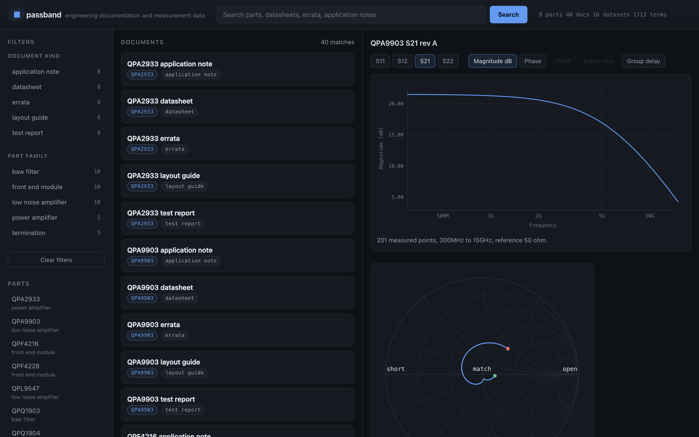

# Passband

A web platform for engineering documentation and the measurement data that goes
with it. Python backend, MariaDB schema, and a front end that plots the data
rather than making you download a file and open it in something else.

The problem it solves is a specific one. RF parts come with two kinds of
artefact: prose documents, which people search, and measurement sweeps, which
people plot. Those normally live in different places, so answering "what does the
errata say and does the measurement show it" means two tools and a lot of
guessing. Here they hang off the same part record.

No dependencies outside the standard library. Python 3.9 or newer.

```
python3 fixtures/generate.py    # build the sample corpus
python3 tests/run.py            # 165 tests
python3 bench/run.py            # writes results/benchmarks.json
python3 server/api.py           # http://127.0.0.1:8080
```



## What is in it

| Path | What it does |
| --- | --- |
| `server/touchstone.py` | Reader for Touchstone measurement files, 1 to n ports |
| `server/rfmath.py` | Derived quantities: return loss, VSWR, group delay, stability |
| `server/schema.py` | One table definition rendered into MariaDB and SQLite |
| `server/store.py` | Repository over DB-API 2.0, dialect neutral |
| `server/search.py` | BM25 full text search with part number boosting |
| `server/ingest.py` | Idempotent bulk load of a document and measurement corpus |
| `server/api.py` | WSGI application, JSON, ETags, static file serving |
| `web/` | Front end: no framework, no build step, charts drawn as SVG |

## The database

MariaDB is the target. SQLite is what the tests run against, so the whole suite
runs with nothing installed and no server to start.

Keeping two hand written `.sql` files in step is exactly the sort of thing that
rots, so the tables are declared once as data in `schema.py` and each dialect is
rendered from that. The differences that actually matter are explicit rather than
smoothed over:

- `AUTO_INCREMENT` against `INTEGER PRIMARY KEY AUTOINCREMENT`
- `VARCHAR(n)` is required on an indexed MariaDB column and meaningless in SQLite
- MariaDB gets `ENGINE=InnoDB` and a `utf8mb4` collation
- SQLite ignores foreign keys unless you enable them per connection, which
  `store.py` does, because a test suite that does not enforce constraints is
  weaker than the database it stands in for

Queries are written once with `?` placeholders and translated at the boundary, so
nothing is welded to one driver. No value is ever interpolated into SQL. The one
thing that legitimately varies, the `ORDER BY` column, goes through an allow list,
and `tests/test_store.py` asserts that `order=body; DROP TABLE parts` is refused.

**How far the MariaDB path is actually verified.** The test suite only checks that
the MariaDB render is well formed, because there is no MariaDB where I built this.
A structural check is weak, so CI closes the gap: a separate job stands up a real
`mariadb:11` service, applies the generated DDL, and fails if any of the eight
tables is missing afterwards. Locally the answer is still "SQLite is tested, the
MariaDB DDL is only rendered", and it is worth knowing which of the two you are
looking at.

## Reading the measurement files

Touchstone looks trivial and is not. The parser handles the parts that bite:

- the option line is optional and any of its four fields may be omitted
- data pairs are real/imaginary, magnitude/angle or dB/angle, angle in degrees
- **a two port file lists S11 S21 S12 S22**, transposed relative to every other
  port count, which is the single most common way to read one of these wrong
- points fold across several lines for higher port counts
- `!` starts a comment anywhere, including after data

Everything is normalised on the way in to frequency in hertz and complex
parameters, so nothing downstream cares what the file said. Round trip tests write
each network back out in all three formats and all four frequency units and check
the values survive.

## Two bugs the tests did not catch

Both were found by trying to render real data, and both are the kind that would
have shown a wrong number to an engineer rather than crashing.

**VSWR of a transmission parameter.** The trace endpoint accepted any combination
of port indices and quantity, so `S21` with `kind=vswr` was a legal request. VSWR
is defined from a reflection coefficient; on an amplifier where `|S21|` is 11.8 the
formula divides by a negative number and returns infinity. 201 infinities, one per
point, and the JSON encoder refused the payload. The formula was never wrong,
asking for it was, so the fix is a domain restriction: reflection quantities are
refused off the diagonal, the API answers 400 naming the reason, and the front end
disables those buttons instead of offering a request that cannot succeed. As
defence in depth a non finite float now serialises as `null`, because a perfect
open really does have infinite VSWR and a gap in the chart is more honest than a
clamped number.

**A passive filter with gain.** The fixture generator applied its ripple as a
symmetric random factor on top of a response that already reached unity at band
centre, so every bandpass had `|S21|` up to 1.02. A filter that amplifies is not
physical. My existing assertion, `max_gain_db < 0.5`, passed happily on 0.134 dB.
Ripple now only ever attenuates, the generator asserts passivity as it writes each
file, and `tests/test_physics.py` checks every passive fixture independently.

## The bug only the screen could find

The Smith chart came out as a scribble. Every unit test passed: magnitudes were
right, the parser round tripped, the summary numbers were sane. The generator was
drawing each reflection point at a uniform random phase, so `|S11|` was correct at
every frequency and the locus between points was nonsense. A real reflection
rotates smoothly because the reference plane sits some electrical length from the
device.

That is now modelled properly, and the property is asserted directly in
`tests/test_locus.py`: adjacent points must be close together, since the
coefficient is a continuous function of frequency. The test carries its own
negative control, a synthetic random phase locus that the same check has to
reject, so a passing run means the detector works rather than merely that nothing
tripped.

The general lesson I took from it: a plot is a test surface. Three modules were
individually correct and the composition was still wrong, and nothing short of
drawing it would have said so.

## Search

BM25 over an inverted index kept in the database, so it survives a restart and
there is one copy of the truth.

BM25 rather than plain TF-IDF because document lengths here differ by roughly five
to one between a short errata and a full application note, and the length
normalisation is what stops the long ones winning on volume alone. An exact part
number match adds a fixed boost so that `QPF4216` returns that part's own
documents ahead of prose that merely mentions the family, and title hits are
weighted above body hits.

Quality is measured, not asserted: `tests/test_search.py` carries a labelled query
set where each query has one unambiguously correct document kind, and asserts
precision at 1 of 5/5. It is a small set and it is synthetic data, so it is a
regression guard rather than a claim about search quality in general.

## Numbers

From `results/benchmarks.json`. Read the environment note below before quoting any
of these.

| | |
| --- | --- |
| Touchstone parsing | 423 sweeps/s, 80,846 frequency points/s |
| Full corpus ingest | 91 ms for 56 files, 441 documents/s |
| Unchanged re-ingest | 51 ms, 1.8x faster, nothing rewritten |
| Search | p50 0.5 ms, p99 1.3 ms across 10 queries |
| Trace endpoint | p50 3.6 ms for 201 points and 6.9 KB of JSON |
| Document listing | p50 0.5 ms, 3.6 KB |

**Environment, and why it matters.** These were measured under CPython 3.12
compiled to WebAssembly, because no native interpreter was available on the
machine I built this on. Two consequences, both real:

1. WebAssembly is meaningfully slower than native CPython, so these are a floor
   rather than a fair reading of the code.
2. The runtime clamps `perf_counter` to a **0.1 ms** resolution, measured in the
   benchmark itself rather than assumed. Every figure at or below 0.1 ms is the
   clock, not the code, which covers `health`, `facets` and `dataset_detail`. I
   have left them in the JSON and I am not quoting them as measurements.

The numbers worth reading are the ones comfortably above that floor: ingest,
the trace endpoint, and the search p99.

**The ETag saves bytes and nothing else.** A revalidated 304 on the trace endpoint
came back at p50 3.2 ms against 3.6 ms for the full response, which is inside the
noise. That is not a disappointing result, it is the correct one: the tag is a
hash of the body, so the server has already parsed the file and built the payload
before it can decide to send a 304. It saves 6,932 bytes per hit on the endpoint
the front end requests most, and no server work at all. Reporting it as a latency
win would have been the easiest misleading number in the project.

## Front end

No framework and no build step. The files served are the files in the repository,
which for an internal tool removes a whole class of "the deployed bundle is stale"
problem.

The charts are drawn straight into SVG. That is not minimalism for its own sake: a
frequency plot needs a log axis with engineering suffixes, ticks that land on 1, 2
and 5 rather than wherever, and a shared cursor that prints the exact sample,
because reading a value off a plot by eye is how wrong numbers end up in reports.
The Smith chart draws its own grid from the conformal map, so constant resistance
circles and constant reactance arcs stay crisp at any size and sit in the same
coordinate system as the trace.

The front end is verified against real backend output rather than a mock:
`tests/snapshot_api.py` captures 23 genuine API responses covering 3,216 plotted
points, and the browser check replays those, asserting the chart, the Smith grid,
the summary table and the disabled state of the reflection only controls all
render.

## Tests

165 tests, about 2 seconds.

```
tests/test_api.py          41   routes, ETags, validation, traversal
tests/test_rfmath.py       30   derived quantities against closed forms
tests/test_touchstone.py   29   option line, formats, port ordering, malformed input
tests/test_store.py        22   schema, constraints, transactions, paging
tests/test_search.py       21   tokenizer, ranking, filters, labelled query set
tests/test_physics.py      11   passivity, trace domains, serialisation
tests/test_ingest.py        7   idempotency, partial failure, recomputation
tests/test_locus.py         4   reflection continuity, with a negative control
```

The API tests call the WSGI application directly. No socket, no server thread, so
they are as fast and as deterministic as the unit tests while still exercising the
real request path.

## Limitations

- The MariaDB schema is rendered and structurally checked, never executed.
- Measurement files are parsed on demand and not cached, which is what keeps the
  displayed numbers honest after a file is corrected, and what makes the trace
  endpoint the slowest one.
- Search has no stemming and no phrase queries.
- The corpus is synthetic. It is built from textbook responses with known answers
  so the tests can assert real numbers, not to look like anyone's actual parts.
- Single process, no auth, no write API. It reads a corpus and serves it.
